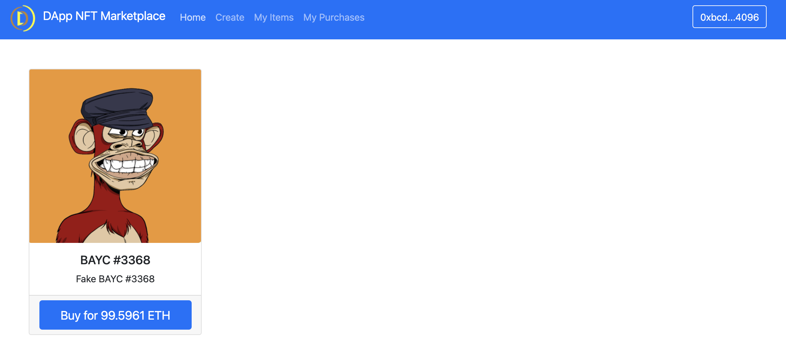
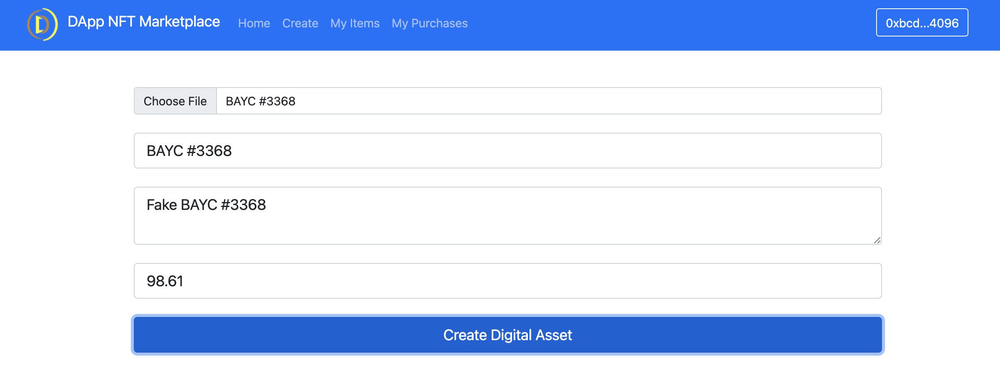
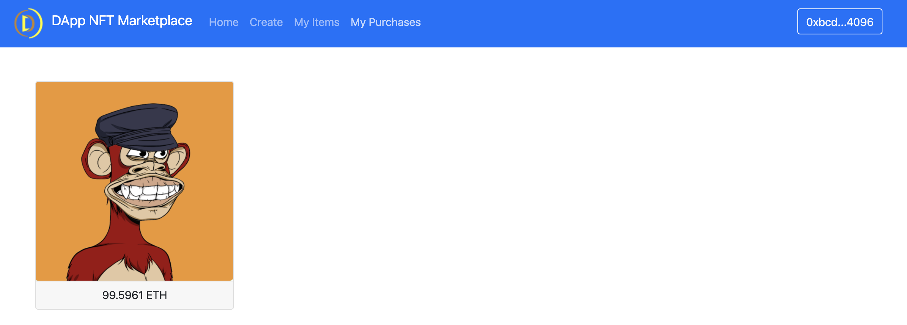

<!-- PROJECT LOGO -->
<br />
<p align="center">
  <a href="https://github.com/rom1trt/nft-marketplace">
    
  </a>

  <h3 align="center"> DApp NFT Marketplace (OpenSea lookalike)</h3>

  <p align="center">
    A simple replica of the popular NFT marketplace OpenSea
    <br />
    <a href="https://github.com/rom1trt/nft-marketplace"><strong>Explore the docs »</strong></a>
    <br />
    <br />
    <a href="https://github.com/rom1trt/nft-marketplace">View Demo</a>
    ·
    <a href="https://github.com/rom1trt/nft-marketplace/issues">Report Bug</a>
    ·
    <a href="https://github.com/rom1trt/nft-marketplace/issues">Request Feature</a>
  </p>
</p>

<!-- TABLE OF CONTENTS -->
<details open="open">
  <summary>Table of Contents</summary>
  <ol>
    <li>
      <a href="#about-the-project">About The Project</a>
      <ul>
        <li><a href="#built-with">Built With</a></li>
      </ul>
    </li>
    <li>
      <a href="#getting-started">Getting Started</a>
      <ul>
        <li><a href="#requirements">Requirements</a></li>
        <li><a href="#installations">Installations</a></li>
        <li><a href="#features">Features</a></li>
      </ul>
    </li>
  </ol>
</details>

<!-- ABOUT THE PROJECT -->

## About The Project

A Marketplace that enables users to Mint, Buy, and Sell NFTs.

```
HOME
```



```
MINT NFT
```


    
````
MY PURCHASES
````


### Built With

- [Solidity](https://www.solidity.io/)
- [Javascript](https://www.javascript.com/)
- [Ethers.js](https://docs.ethers.io/v5/)
- [Hardhat](https://hardhat.org/)
- [IPFS](https://ipfs.io/)

<!-- GETTING STARTED -->

## Getting Started

This is an example of how you may give instructions on setting up your project locally.
To get a local copy up and running follow these simple example steps.

### Requirements

- [Install NodeJS](https://nodejs.org/en/download/)
- Install Hardhat `npm install hardhat --save-dev hardhat`
- [Install Metamask](https://metamask.io/)
- Install the network Hardhat from Metamask Wallet(Settings -> Networks -> Add Network)

### Launch [Frontend](https://nft-marketplace-eight-snowy.vercel.app/)

## Installations

### Local Installation

#### 1. Clone the repository

`git clone https://github.com/rom1trt/nft-marketplace.git`

#### 2. Install NPM (Node Package Manager)

`npm install`

#### 3. Initialize local development blockchain

`npx hardhat node`

- Copy private key of the addresses and import to Metamask
- Connect your metamask to hardhat blockchain, network 127.0.0.1:8545.
- If you have not added hardhat to the list of networks on your metamask, open up a browser, click the fox icon, then click the top center dropdown button that lists all the available networks then click add networks. A form should pop up. For the "Network Name" field enter "Hardhat". For the "New RPC URL" field enter "http://127.0.0.1:8545". For the chain ID enter "31337". Then click save.

#### 4. Run tests

`npx hardhat test`

#### 5. Deploy smart contracts locally (local host) from the terminal

`npx hardhat run src/backend/scripts/deploy.js --network localhost`

#### 6. Launch Frontend locally (localhost)

`npm run start`

### Installation Polygon Testnet (Mumbai)

#### 1. Repeat steps 1-2

#### 2. Sign up/Log in on [Alchemy](https://www.alchemy.com/) and create a new project with Polygon Mumbai as network

#### 3. Add your Alchemy API key and Metamask private key in the .env file

#### 4. Refresh environment variables

`source .env`

#### 5. Deploy smart contracts on Mumbai Testnet from the terminal

`npx hardhat run src/backend/scripts/deploy.js --network mumbai`

### Features

- Mint an ERC721 nft and list it on the marketplace
- Buy the any assets listed on the marketplace
- Sell the NFTs you own
